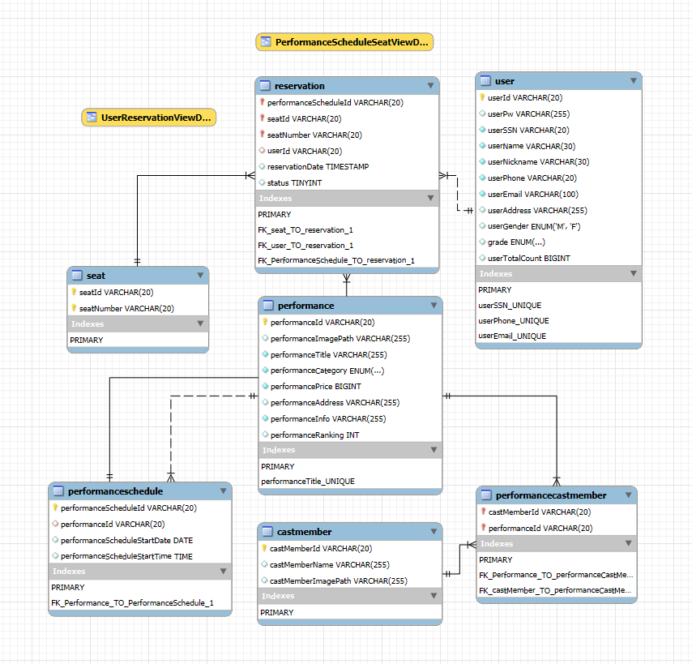

# 🎟️ TicketNow – 공연 예매 플랫폼

사용자가 공연·전시·이벤트 티켓을 쉽고 빠르게 예매할 수 있도록 구현된 웹 기반 티켓 예매 서비스입니다.

---

## 📌 프로젝트 정보

| 항목 | 내용 |
|------|------|
| 프로젝트 기간 | 2025.09.26 ~ 2025.11.17 |
| 팀명 / 인원 | TicketNow Team (3명) — 유기태, 박형빈, 조연희 |
| 사이트 주소 | [http://43.201.71.58:8080/](http://43.201.71.58:8080/) |
| 기획/디자인 | Figma - 유스케이스 / Figma - 디자인 |
| ERD |  |
| 프로젝트 관리 | [GitHub](https://github.com/full-stack-bootcamp-team-project/ticket-now) |

---

## 💡 서비스 개요

TicketNow는 티켓 예매 서비스 전체 흐름을 구현한 웹 플랫폼입니다.  
회원 관리 → 검색 → 상세 보기 → 예매 → 마이페이지 관리까지 모든 기능 포함.

---

## ⚙️ 주요 기능

### 🖥️ 메인 / 검색
- 메인 배너 자동 슬라이드
- 공연 목록 조회 (전체/인기/최신)
- 카테고리별 필터링
- 통합 검색 / 카테고리 / 제목 / 출연자 검색
- 자동 완성 + 키워드 하이라이트
- 검색 결과 랭킹 표시

### 👤 회원
- 회원가입 (실시간 유효성 검증 + 중복 확인)
- 로그인 / 로그아웃 / 로그인 상태 확인
- 아이디 찾기 (이름 + 주민등록번호)
- 비밀번호 찾기 및 재설정
- 세션 기반 로그인 유지

### 🎛️ 마이페이지
- 내 정보 조회·수정 (유효성 검사 + 중복 확인)
- 비밀번호 변경 (현재 비밀번호 검증 후 가능)
- 예매 목록 조회 및 취소
- 구매 금액 기반 회원 등급 표시
- 로그인 상태에 따라 접근 제어(인터셉터)


### 🎭 공연 상세
- 공연 상세 정보 조회
- 공연 일정 존재 여부 확인 → 예매 가능 여부 안내
- 출연자 정보 표시
- Kakao Map 기반 공연장 위치 노출

### 🎟️ 예매
- 공연 상세 정보 표시
- 공연 일정 기반 달력 렌더링
- 날짜 선택 → 회차 선택
- 회차별 좌석 상태 표시(예약 불가 좌석 disable)
- 예매 정보 DB 저장

---

## 🛠️ 기술 스택

**Backend**
- Java 21, Spring Boot 3.5.6, Spring Security, JPA / Hibernate, MyBatis, Lombok

**Frontend**
- JSP, Thymeleaf, JavaScript (ES6), CSS

**Infra & DevOps**
- AWS EC2, Apache Tomcat, MySQL, Git / GitHub Projects, ERDCloud / Figma

---


## 🗄️ ERD


## 👥 팀원별 담당 기능

**👮 유기태 — 마이페이지 & 회원 기능**
- 로그인 상태 확인 후 페이지 이동 제어
- 내 정보 조회 및 전역 변수 기반 즉시 반영
- 이메일·전화번호 중복 확인 + 유효성 검사
- 비밀번호 변경 (현재 비밀번호 인증 → 변경)
- 예매 내역 조회·페이징·삭제
- 구매 금액 기반 등급 표시
- 인터셉터 기반 접근 제어

**🙋‍♂️ 박형빈 — 공연 상세 & 예매**
- 공연 상세 정보 조회 (포스터, 줄거리, 이미지, 가격 등)
- 공연 일정 확인 → 예매 가능 여부 안내
- 출연자 정보 노출
- Kakao Map으로 공연장 위치 표시
- 달력 일정 표시 및 날짜/회차 선택
- 좌석 현황 표시, 예약된 좌석 disable
- 예매 정보 DB 저장

**👩‍🚀 조연희 — 헤더/검색/메인/회원가입/로그인**
- 헤더 공통: 카테고리 분류, 검색 타입, 자동 완성 + 키워드 하이라이트, 동적 메뉴 렌더링
- 메인 페이지: 캐러셀 자동 슬라이드, 인기/최신 공연 카드 노출, 카테고리별 공연 데이터 로드
- 검색 결과 페이지: 검색 키워드 기반 리스트 노출, 하이라이트 + 랭킹 표시
- 로그인/회원가입: 로그인 상태 유지, 회원가입 유효성 검증, 아이디/비밀번호 찾기 모달, 주소 검색(다음 API)

---

## 🖼️ 스토리보드
| 화면 | 기능 설명 |
|------|-----------|
| 메인 페이지 | 캐러셀 자동 슬라이드, 인기/최신 공연 카드 노출, 카테고리별 공연 데이터 로드 |
| 검색 결과 페이지 | 검색 키워드 기반 리스트 노출, 자동 완성, 키워드 하이라이트, 랭킹 표시 |
| 회원가입 페이지 | 전체 유효성 검사, 중복 확인, 주소 검색 (다음 API) |
| 로그인 페이지 | 로그인 상태 유지, 동적 헤더 메뉴 렌더링 |
| 마이페이지 | 내 정보 조회/수정, 비밀번호 변경, 예매 내역 확인 및 취소, 회원 등급 표시 |
| 공연 상세 페이지 | 공연 정보 조회, 출연자 표시, Kakao Map 위치, 예매 가능 여부 안내 |
| 예매 페이지 | 날짜 선택, 회차 선택, 좌석 선택, 예매 정보 DB 저장 |

---

## 📦 프로젝트 구조
```markdown
ticket-now/
├─ src/
│ ├─ main/
│ │ ├─ java/com/ticketnow/
│ │ │ ├─ user/
│ │ │ │ ├─ controller/
│ │ │ │ ├─ model/
│ │ │ │ │ ├─ dto/
│ │ │ │ │ └─ service/
│ │ │ │ └─ repository/
│ │ │ ├─ performance/
│ │ │ │ ├─ controller/
│ │ │ │ ├─ model/
│ │ │ │ │ ├─ dto/
│ │ │ │ │ └─ service/
│ │ │ │ └─ repository/
│ │ │ └─ common/
│ │ │ └─ util/
│ │ ├─ resources/
│ │ │ ├─ static/
│ │ │ │ ├─ css/
│ │ │ │ ├─ js/
│ │ │ │ └─ images/
│ │ │ ├─ templates/
│ │ │ ├─ application.yml
│ │ │ └─ messages.properties
│ └─ test/
├─ build.gradle
├─ settings.gradle
└─ README.md
```
---

## 🚀 실행 방법
http://43.201.71.58:8080/

---

## 🎯 결론
TicketNow는 티켓 예매 서비스의 실제 구조를 그대로 구현한 프로젝트로,
검색 → 상세 → 예매 → 마이페이지까지 모든 흐름을 완성한 팀 프로젝트입니다.
